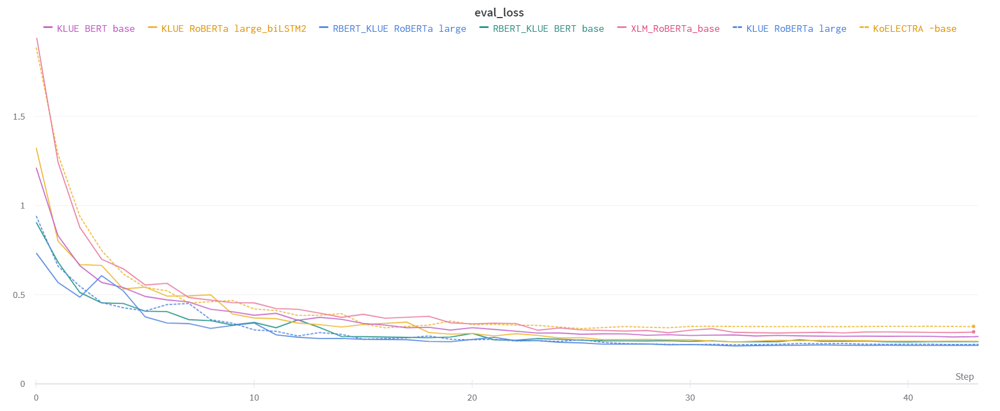

# [네이버 부스트캠프 AI Tech 3기] Relation Extraction Competition

## 대회 주제

KLUE RE dataset을 이용해서 문장 내 개체간 관계를 추출하는 AI 알고리즘 개발 

본 대회에 대한 세부적인 내용은 아래 링크를 통해 확인하실 수 있습니다.

https://guiltless-tiglon-d23.notion.site/RE-Wrap-Up-Report-3b196cec29f24da4bc813930be950d7c

# Performance



|Model|Loss|F1-score|
|:-------------:|:-----------------:|:------------------:|
|KLUE BERT base|0.2649|83.208|
|KLUE roBERTa large|0.2211|**86.302**|
|LSTM roBERTa large|0.2399|85.587|
|R-BERT BERT base|0.2365|84.384|
|R-BERT roBERTa base|**0.2149**|86.114|
|XLM RoBERTa base|0.2887|82.605|
|KoELECTRA base|0.3162|81.282|

# How to use

1. Install requirements

        pip install -r requirements.txt
        
2. Run

        python train.py
        
3. [Option]
```
    --seed              type=int        default=42
    --model             type=str        default="klue/bert-base"
    --epochs            type=int        default=5
    --logging_step      type=int        default=100
    --eval_step         type=int        default=100
    --checkpoint        type=bool       default=False
    --batch_size        type=int        default=64
    --valid_batch_size  type=int        default=64
    --optimizer         type=str        default="AdamW"
    --lr                type=float      default=5e-5
    --val_ratio         type=float      default=0.1
    --criterion         type=str        default="cross_entropy" # 'cross_entropy', 'focal', 'label_smoothing', 'f1'
    --save_dir          type=str        default="./results"
    --report_name       type=str        
    --project_name      type=str        default="salt_v2"
    --token_type        type=str        default="origin" # 'origin', 'entity', 'type_entity', 'sub_obj', 'special_entity', 'special_type_entity'
    --wandb             type=bool       default=True
    --dropout           type=float      default=0.1
    --sep_type          type=str        default='SEP'
```
    model은 --save_dir의 경로에 저장합니다.
    wandb를 통해 학습을 기록하고 --project_name과 --report_name를 통해 원하는 project에 원하는 이름으로 학습을 저장할 수 있습니다.
    --wandb를 통해 wandb 기록 여부를 정할 수 있습니다.
    
    --token_type 은 entity special token를 주는 옵션입니다.
        Should be one of
        - 'origin'              :   이순신은 조선 중기의 무신이다.
        - 'entity'              :   [ENT]이순신[/ENT]은 조선 중기의 [ENT]무신[/ENT]이다.
        - 'type_entity'         :   [PER]이순신[/PER]은 조선 중기의 [POH]무신[/POH]이다.
        - 'sub_obj'             :   [SUB]이순신[/SUB]은 조선 중기의 [OBJ]무신[/OBJ]이다.
        - 'special_entity'      :   @ 이순신 @ 은 조선 중기의 # 무신 # 이다.
        - 'special_type_entity' :   @ * 사람 * 이순신 @ 은 조선 중기의 # ^ 지위 ^ 무신 # 이다.
        
        
    --sep_type은 input으로 들어오는 entity를 [SEP] token으로 나눌지 entity token으로 나눌지에 대한 옵션입니다.
        Should be one of
        - 'SEP' : [CLS]이순신[SEP]무신[SEP]이순신은 조선 중기의 무신이다.
        - 'ENT' : [CLS][PER]이순신[/PER][POH]무신[/POH][SEP]이순신은 조선 중기의 무신이다.
